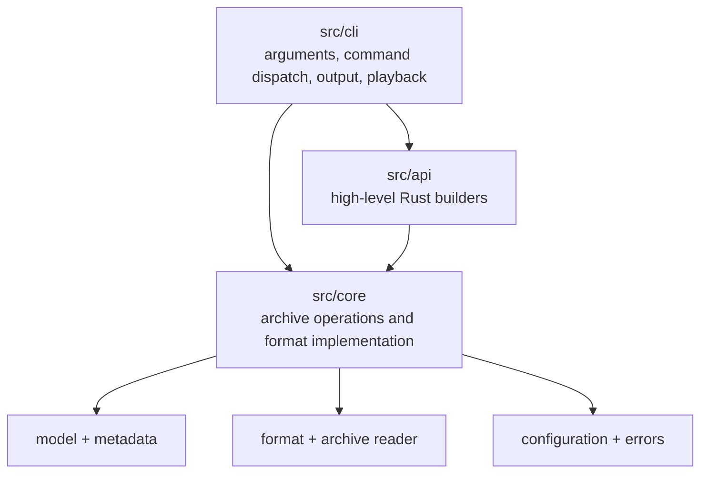
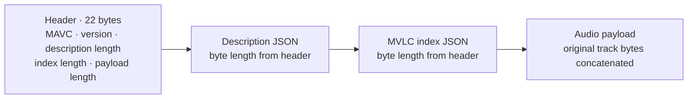
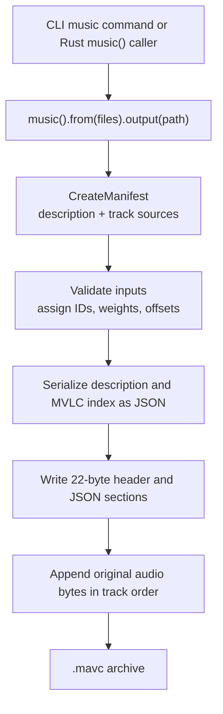

# MAVC  mutiple audio version collection

**English** | [简体中文](README.zh-CN.md)

Hi,Have you ever noticed that a song can have several versions, such as English
and Chinese versions, covers by different singers, or alternate arrangements?
Each version takes several minutes to play, so listening through all of them
can take a while. MAVC packages related versions into one `.mavc` archive and
randomly selects a track when you play it, adding variety to each listen.

MAVC is a Rust music archive library and command-line tool for MP3, FLAC, and
AAC. Each archive contains a description, an MVLC music index, and the original
audio data. Track weights control how often each track is selected during
weighted random playback. MAVC is currently in the refinement stage of version
1.0. This is also a learning and research project, and I’ll explore support
for more players in the future.

## CLI help

Run `mavc --help`, `mavc -h`, or `mavc help` to display this command list.

```text
mavc — weighted music archive tool
Usage:
  mavc help|--help|-h
  mavc version|--version|-V|-v
  mavc package -m <audio-file>... [-a <output.mavc>]
  mavc package <manifest.json> <output.mavc>
  mavc music -m <audio-file>... [-a <output.mavc>]
  mavc music -a <output.mavc> -m <audio-file>...
  mavc create <manifest.json> <output.mavc>
  mavc [-+|--add] <audio-file>... --to <archive.mavc>...
  mavc [-x|--remove] <track-id>... --from <archive.mavc>...
  mavc list <archive.mavc>
  mavc play [-r|--random | -o|--one <track-id> | -c|--combine <track-id> <track-id>...] [--all] [-sp|--system-player | -bp|--browser-player] <archive.mavc>
  mavc inspect <archive.mavc> [track-id]
  mavc inspect <track-id> <archive.mavc>
  mavc pick <archive.mavc>
  mavc weight <archive.mavc> <track-id>=<weight>
  mavc extract <archive.mavc> <track-id> [output-file]
```

## Commands

- **`help`, `--help`, `-h`** — Show command usage.
- **`version`, `--version`, `-V`, `-v`** — Show the MAVC version.
- **`package -m <files>... [-a <output.mavc>]`** — Package audio files with equal initial weights (`1 / track count`). Without `-a`, one file produces `<filename>.mavc`; multiple files produce `music.mavc`.
- **`package <manifest.json> <output.mavc>`** — Package tracks described by a JSON manifest.
- **`music -m <files>... [-a <output.mavc>]`** — Shortcut for packaging a music list with equal initial weights (`1 / track count`). The `-m` and `-a` options may appear in either order.
- **`create <manifest.json> <output.mavc>`** — Alias for manifest-based packaging.
- **`--add` / `-+ <files>... --to <archives>...`** — Add audio files to each archive; each resulting archive may contain at most 5 tracks and 150 MB of audio payload. New tracks start with weight 1.
- **`--remove` / `-x <track-ids>... --from <archives>...`** — Remove at least two specified track IDs from each archive.

Archive limits are read from `mavc` in the current working directory. If the file is absent, MAVC uses 5 tracks and 150 MB by default. Configure them with:

```toml
[limits]
max_tracks = 5
max_size_mb = 150
```

`max_size_mb` uses decimal megabytes (1 MB = 1,000,000 bytes) and applies to audio payload size.
- **`list <archive.mavc>`** — List tracks and show their IDs, formats, and weights.
- **`play [-r|--random] <archive.mavc>`** — Choose a track by its weight and play it with MAVC's built-in player. Random playback is the default.
- **`play -o|--one <track-id> <archive.mavc>`** — Play one specified track ID.
- **`play --all <archive.mavc>`** — Play every track in archive order with MAVC's built-in player.
- **`play -c|--combine <track-ids>... <archive.mavc>`** — Mix at least two specified tracks at the same time. Add `-bp` to mix them in the browser; `-sp` shows a warning and falls back to the built-in player.
- **`play -sp|--system-player <archive.mavc>`** — Export all tracks to a temporary playlist and open it with the system's associated player. With `--combine`, MAVC warns and uses its built-in player.
- **`play -bp|--browser-player <archive.mavc>`** — Save the archive's tracks and an HTML selection page in a temporary folder, then open the page in the default browser. Browser autoplay settings may require clicking Play.
- **`inspect <archive.mavc> [track-id]`** or **`inspect <track-id> <archive.mavc>`** — Show archive information and available track metadata, such as title, artist/singer, album, genre, year, duration, bitrate, sample rate, channels, and bit depth. Missing tags are omitted.
- **`pick <archive.mavc>`** — Print a weighted random track selection without playing it.
- **`weight <archive.mavc> <track-id>=<weight>`** — Set one track's random-selection weight from 0 to 1, then divide the remaining weight evenly among all other tracks. For example, in a four-track archive, setting one track to `0.4` sets each other track to `0.2`. Weight `0` excludes the selected track from random selection; weight `1` excludes all other tracks.
- **`extract <archive.mavc> <track-id> [output-file]`** — Extract a track. If no output filename is given, MAVC uses the track's stored filename and extension.

`-r`/`--random` and `-o`/`--one` are mutually exclusive. The browser player also
accepts the legacy misspelling `--broswer-player`. The `inspect` command reads
metadata from older archives when it is not cached in the MVLC index.

## Archive format

Version 1 uses little-endian integers. Its 22-byte header contains the `MAVC`
magic, container version (`u16`), description length (`u32`), MVLC index length
(`u32`), and audio payload length (`u64`). The description and index are JSON
objects, followed by the concatenated audio payloads. Track offsets in the
index are relative to the beginning of the payload section. The container and
MVLC index version are both currently `1`.

### Code layout



`mavc` re-exports the public types and operations, so callers can use
`mavc::Archive`, `mavc::create_archive`, or the higher-level
`mavc::music()` builder without depending on internal module paths.

### Archive layout



Each index track stores an `offset` and `length`. The offset is relative to the
start of the audio payload, so its absolute file position is:

```text
payload_start = 22 + description_length + index_length
track_position = payload_start + track.offset
```

The index also stores each track's ID, display title, original filename, codec,
weight, and cached audio metadata. The description and index are UTF-8 JSON;
the audio section contains the original encoded audio bytes without
transcoding. This byte layout is language-neutral, so other implementations
can read and write MAVC files by following the same field sizes, byte order,
JSON fields, and offset rules.

### Creation flow



The public `music()` builder prepares a manifest and delegates to the same
core archive writer used by the CLI. The writer records payload-relative
offsets before streaming each source file into the payload section.

## Windows

Install Rust with rustup, then build from PowerShell in the project folder:

```powershell
cargo build --release
.\target\release\mavc.exe --help
.\target\release\mavc.exe package -m .\song.mp3 .\song.flac -a .\music.mavc
.\target\release\mavc.exe play -r .\music.mavc
```

The built-in player uses the default Windows audio device. The `-sp` and `-bp`
options open the audio file or browser page through Windows file associations.

## Desktop app frontend (`mavc-app`)

`mavc-app` is MAVC's desktop application. Its user interface is written in Rust
with Dioxus and runs in a Tauri 2 webview. The frontend calls Tauri commands
through a small typed bridge; the desktop command layer delegates archive work
to the local `mavc` Rust library.

### Features

- **Open and manage archives:** Load a `.mavc` archive, reload it, return to the
  start screen, and add audio files to the currently open archive.
- **Browse and inspect tracks:** Select a track in the library to view its cover
  art, title, artist, album, genre, year, weight, and available scraping
  information.
- **Edit track details:** Update the track title, artist, album, genre, year,
  cover image URL, and playback weight. Tracks can also be removed from the
  archive.
- **Weighted playback:** Play a weighted random selection, play tracks in
  archive order, or start a chosen track. Track weights influence random
  selection.
- **Combine selected tracks:** Check tracks in the library and play the
  selection together, with separate seek controls for each source track.
- **Playback controls:** Pause and resume playback, drag the progress bar to
  seek, and move an individual combined track forward or backward by 0.5
  seconds.
- **Export archives:** Create an archive from audio files or export the current
  archive to a chosen path.
- **Choose a look and language:** Switch between the Apple and Classic Midnight
  themes, and use Traditional Chinese, Simplified Chinese, English, or Japanese.

All archive and track changes are handled locally by the MAVC library.

### Frontend layout

```text
mavc-app/
├── src/
│   ├── app.rs                 # App module wiring
│   ├── app/
│   │   ├── frontend.rs        # Dioxus views and UI event bindings
│   │   ├── logic.rs           # Reactive app state and derived view data
│   │   ├── bridge.rs          # Typed calls from the webview to Tauri
│   │   ├── models.rs          # Frontend data transfer types
│   │   ├── i18n.rs            # Traditional Chinese, Simplified Chinese, English, and Japanese
│   │   ├── formatting.rs      # Track labels and display formatting
│   │   └── playback.rs        # Webview audio controls
│   └── main.rs               # Dioxus application entry point
├── assets/styles.css         # Themes and interface styles
└── src-tauri/
    └── src/commands.rs       # Desktop commands backed by the mavc library
```

`frontend.rs` renders the player, archive list, track details, and archive tools.
`logic.rs` owns shared reactive state and derives the values displayed by those
views. `bridge.rs` converts typed frontend requests into Tauri command calls,
while `src-tauri/src/commands.rs` handles desktop access and calls the MAVC
library. The UI includes Apple and Classic Midnight themes and Traditional
Chinese, Simplified Chinese, English, and Japanese.

### Develop and package the desktop app

Install Rust, the Dioxus CLI (`dx`), the Tauri CLI (`cargo tauri`), and the
native build prerequisites for your operating system. From the `mavc-app`
directory, run:

```sh
cargo tauri dev
```

To create a release bundle for the current operating system, run:

```sh
cargo tauri build
```

The Tauri configuration starts the Dioxus development server with
`dx serve --port 1420 --interactive false` and builds the frontend with
`dx bundle --release`.

## License

MAVC is licensed under the Apache License, Version 2.0. See [LICENSE](LICENSE).
