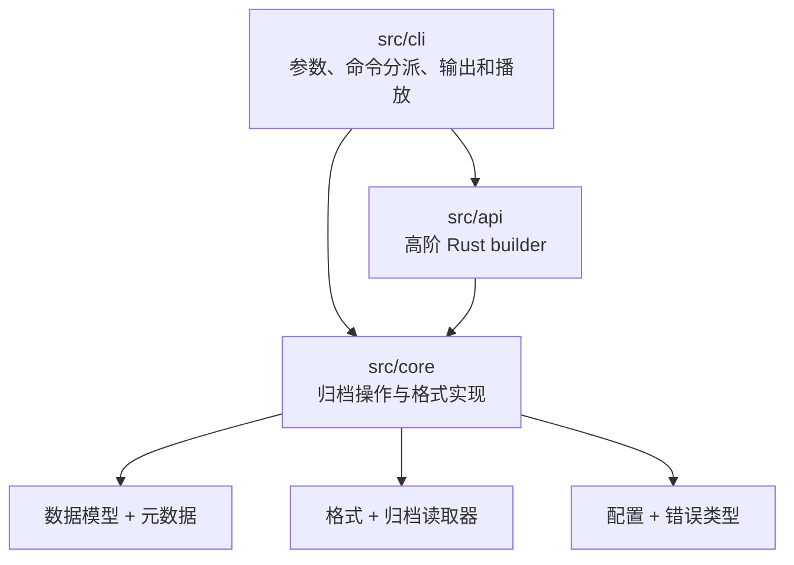
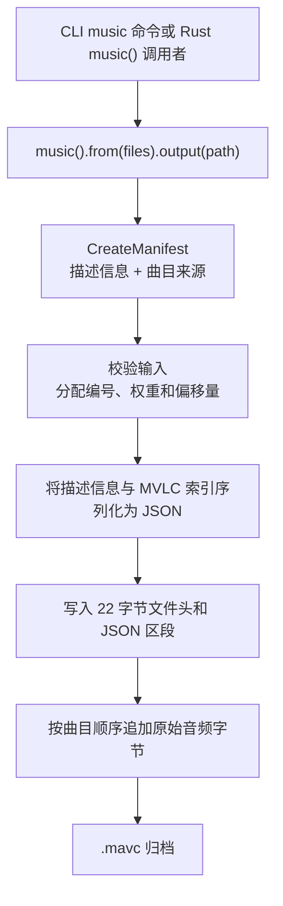

# MAVC mutiple audio version collection

[English](README.md) | **简体中文**

您好！您是否也遇到过同一首歌有多个版本的情况？例如中英文版本、不同歌手
的翻唱，或不同编曲版本。每个版本可能需要几分钟才能听完，因此把所有版本
都听一遍需要不少时间。MAVC 可以将相关版本打包到同一个 `.mavc` 文件中，
并在播放时随机选择其中一首，让每次收听都有更多变化。

MAVC 是一个使用 Rust 编写的音乐归档库和命令行工具，支持 MP3、FLAC 和 AAC。
每个归档包含描述信息、MVLC 音乐索引和原始音频数据。曲目权重用于控制加权
随机播放时各曲目被选中的频率。MAVC 目前处于 1.0 版本完善階段。这也是一个
学习和研究的过程；未来会继续探索支持更多播放器的可能性。

## 命令行帮助

运行 `mavc --help`、`mavc -h` 或 `mavc help` 可显示以下命令列表。

```text
mavc — weighted music archive tool
Usage:
  mavc help|--help|-h
  mavc version|--version|-V|-v
  mavc package -m <audio-file>... [-a <output.mavc>]
  mavc package <manifest.json> <output.mavc>
  mavc music -m <audio-file>... [-a <output.mavc>]
  mavc music -a <output.mavc> -m <audio-file>...
  mavc create <manifest.json> <output.mavc>
  mavc [-+|--add] <音频文件>... --to <归档.mavc>...
  mavc [-x|--remove] <曲目编号>... --from <归档.mavc>...
  mavc list <archive.mavc>
  mavc play [-r|--random | -o|--one <track-id> | -c|--combine <track-id> <track-id>...] [--all] [-sp|--system-player | -bp|--browser-player] <archive.mavc>
  mavc inspect <archive.mavc> [track-id]
  mavc inspect <track-id> <archive.mavc>
  mavc pick <archive.mavc>
  mavc weight <archive.mavc> <track-id>=<weight>
  mavc extract <archive.mavc> <track-id> [output-file]
```

## 命令说明

- **`help`、`--help`、`-h`** — 显示命令用法。
- **`version`、`--version`、`-V`、`-v`** — 显示 MAVC 版本。
- **`package -m <文件>... [-a <输出.mavc>]`** — 将音频文件打包成归档，初始权重均分（每首为 `1 / 曲目数`）。省略 `-a` 时，单个文件生成 `<文件名>.mavc`，多个文件生成 `music.mavc`。
- **`package <manifest.json> <输出.mavc>`** — 按 JSON 清单中的曲目信息打包。
- **`music -m <文件>... [-a <输出.mavc>]`** — 打包音乐列表的快捷命令，初始权重均分（每首为 `1 / 曲目数`）。`-m` 和 `-a` 选项可以按任意顺序排列。
- **`create <manifest.json> <输出.mavc>`** — 使用清单打包的别名命令。
- **`--add` / `-+ <文件>... --to <归档>...`** — 向每个归档添加音频文件；更新后的归档最多包含 5 首曲目，音频数据总量不超过 150 MB。新曲目权重为 1。
- **`--remove` / `-x <曲目编号>... --from <归档>...`** — 从每个归档删除至少两个指定编号的曲目。

归档限制从当前工作目录的 `mavc-lib/mavc.toml` 读取。文件不存在时，默认最多 5 首、150 MB。配置示例：

```toml
[limits]
max_tracks = 5
max_size_mb = 150
```

`max_size_mb` 使用十进制 MB（1 MB = 1,000,000 字节），限制的是音频数据总量。
- **`list <归档.mavc>`** — 列出曲目编号、格式和权重。
- **`play [-r|--random] <归档.mavc>`** — 按曲目权重随机选择，并使用 MAVC 内置播放器播放。随机播放为默认模式。
- **`play -o|--one <曲目编号> <归档.mavc>`** — 播放指定编号的曲目。
- **`play --all <归档.mavc>`** — 使用 MAVC 内置播放器按归档顺序播放全部曲目。
- **`play -c|--combine <曲目编号>... <归档.mavc>`** — 同时混音播放至少两首指定曲目。添加 `-bp` 可在浏览器中混音播放；添加 `-sp` 会显示警告并改用 MAVC 内置播放器。
- **`play -sp|--system-player <归档.mavc>`** — 导出全部曲目到临时歌单，并用系统关联的播放器打开。与 `--combine` 同用时会显示警告并改用 MAVC 内置播放器。
- **`play -bp|--browser-player <归档.mavc>`** — 将归档中的曲目和 HTML 选择页面保存到临时文件夹，再用默认浏览器打开。浏览器可能会阻止自动播放，此时请点击播放按钮。
- **`inspect <归档.mavc> [曲目编号]`** 或 **`inspect <曲目编号> <归档.mavc>`** — 显示归档信息和可用曲目元数据，例如标题、歌手、专辑、流派、年份、时长、比特率、采样率、声道数和位深。缺失的标签不会显示。
- **`pick <归档.mavc>`** — 按权重随机选择一首曲目并显示信息，但不播放。
- **`weight <归档.mavc> <曲目编号>=<权重>`** — 将指定曲目的随机播放权重设为 0 到 1，再将剩余权重平均分给其他曲目。例如，4 首曲目中将一首设为 `0.4`，其他每首会设为 `0.2`。设为 `0` 时该曲目不会被随机选中；设为 `1` 时其他曲目权重均为 `0`。
- **`extract <归档.mavc> <曲目编号> [输出文件]`** — 提取曲目。若未指定输出文件名，MAVC 会使用曲目原有文件名和扩展名。

`-r`/`--random` 和 `-o`/`--one` 不能同时使用。浏览器播放器也兼容旧拼写
`--broswer-player`。如果旧归档的 MVLC 索引中没有缓存元数据，`inspect` 会从
音频数据中读取。

## 归档格式

版本 1 使用小端序整数。22 字节的文件头包含 `MAVC` 标记、归档版本（`u16`）、
描述信息长度（`u32`）、MVLC 索引长度（`u32`）和音频数据长度（`u64`）。文件头
之后依次为 JSON 格式的描述信息、索引以及拼接后的音频数据。索引中的曲目偏移量
以音频数据区起始位置为基准。目前归档格式和 MVLC 索引版本均为 `1`。

### 代码结构



`mavc-lib/src` 重新导出公开类型和操作，因此调用者可以使用
`mavc::Archive`、`mavc::create_archive` 或更高阶的 `mavc::music()` builder，
不必依赖内部模块路径。

### 归档布局


索引中的每首曲目都有 `offset` 和 `length`。`offset` 相对于音频数据区起点，
因此曲目在文件中的绝对位置为：

```text
payload_start = 22 + description_length + index_length
track_position = payload_start + track.offset
```

索引还保存曲目编号、显示名称、原始文件名、编码格式、权重和缓存的音频元数据。
描述和索引都是 UTF-8 JSON；音频区保存原始编码后的音频字节，不做转码。这个字节
布局与编程语言无关，其他语言的实现只要遵循相同的字段长度、字节序、JSON 字段和
偏移量规则，就可以读写 MAVC 文件。

### 创建流程



公开的 `music()` builder 会先准备清单，再调用与 CLI 相同的核心归档写入器。写入器
先记录相对于音频区起点的曲目偏移量，再将各来源文件流式写入音频区。

## Windows

请先使用 rustup 安装 Rust，然后在项目目录的 PowerShell 中运行：

```powershell
cargo build --release
.\target\release\mavc.exe --help
.\target\release\mavc.exe package -m .\song.mp3 .\song.flac -a .\music.mavc
.\target\release\mavc.exe play -r .\music.mavc
```

内置播放器通过 Windows 默认音频设备播放；`-sp` 和 `-bp` 会通过 Windows 文件
关联打开音频文件或浏览器页面。

## 许可证

MAVC 使用 Apache License 2.0 授权，详见 [LICENSE](LICENSE)。
